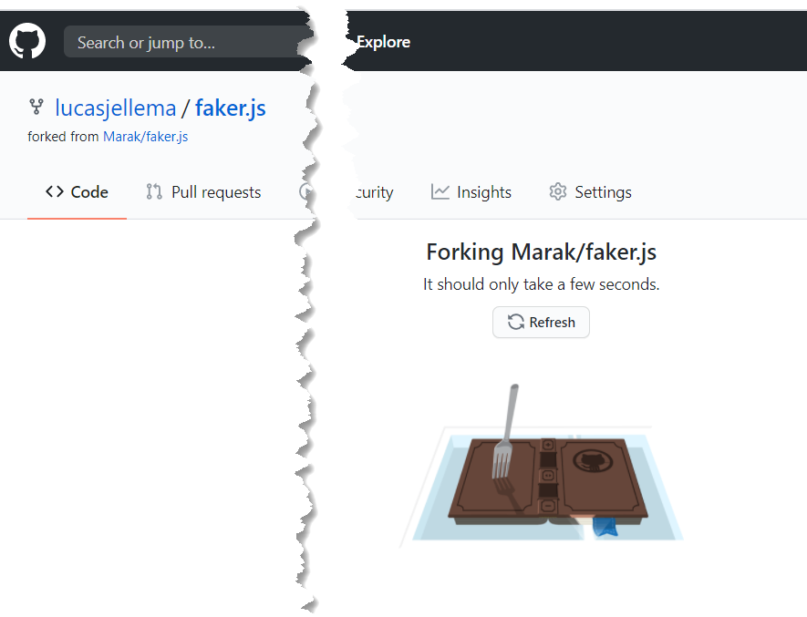
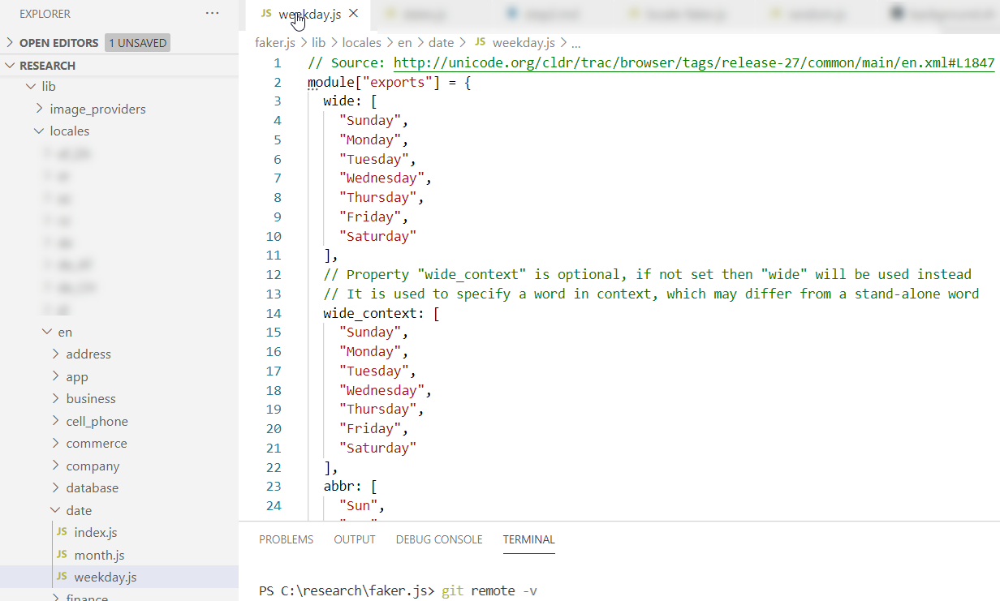
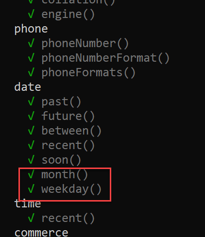
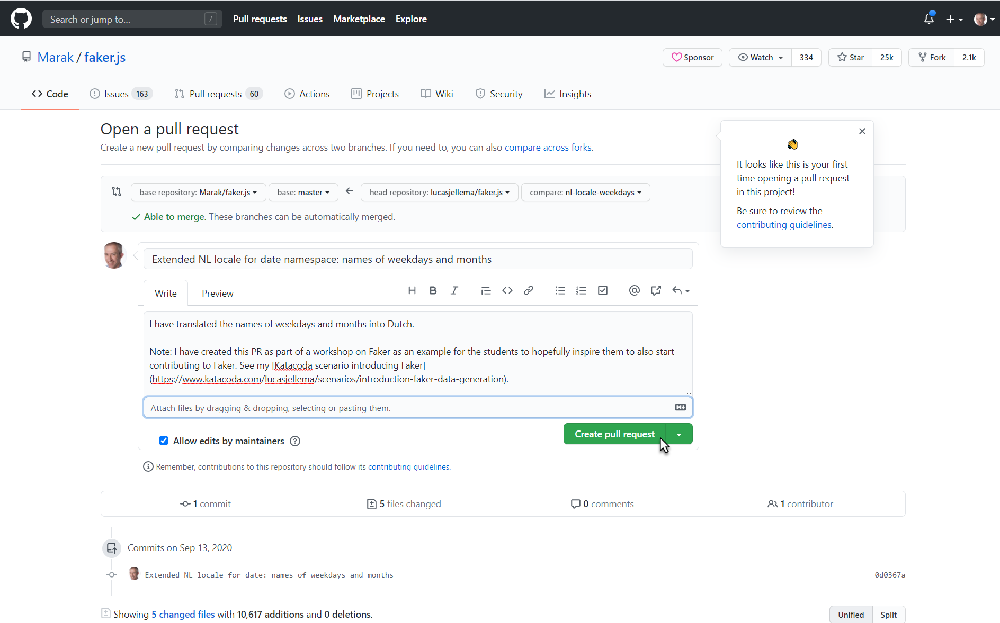

Module Faker is quite useful as it is. However, you can make it even more useful. For yourself and for everyone. We can discern the following levels of usage and participation:

* Using - making use of Faker-as-is
* Complementing and Overriding - replace and add functions to the standard Faker module
* Cloning and Adapting - create a local copy of Faker and customize that copy
* Forking and Contributing - share your improvements [back] with the community

In this step, we will look at levels of customization and participation beyond merely using the Faker module.

# Exploring the code structure of Faker
The source code of Faker can be inspected in GitHub: https://github.com/Marak/faker.js/tree/master/lib. The file *index.js* is the core of the module, where the bootstrap starts. This file contains the definition of the Faker object that is loaded with functions representing the supported domains - such as name, address, company, finance, music, date and vehicle. Each of these domains is defined in its own file in the same lib directory.  

The values returned by the various faker domain data generators are largely defined in the *locales* JavaScript files that live under *lib/locales* (which is located under *node-modules/faker* when you install Faker with npm). For each supported locale, a language and region specific instance of a library file is defined that contains the localized values returned by the corresponding module. 


For example file *faker/lib/locales/de/name/first_name.js* contains the German set of first names that are used in module *faker/lib/name*, overriding the default values in *faker/lib/locales/en/name/first_name.js* in case the local is set to *de*.

Similarly, *faker/lib/locales/nl/address/postcode.js* defines the Dutch postcode format - that is used by function zipcode in *address.js* when generating postcodes.


# Complementing and Overriding

You can of course create enhancements to faker and send a merge request to the maintainers of the project. And you should. We will talk more about that a little further down.

For quick fine tuning of what faker does, you can use other means. Such as overriding functions in the original faker module and adding such similar functions. In the following code snippet, the faker module is required, manipulated and exported. The result can be required in other modules - as a customized wrapper around the original faker module.

<pre>
const faker = require('faker');
// delete the function you would like to override
delete faker['name.jobTitle'];
 
// add new functional with the same name as deleted function
faker.name.jobTitle = function(str){
    return "Coder"
}

faker.timeOff = {} 
faker.timeOff.hobbies = function (str) {
    const hobbies = ["Tennis", "Golf", "Fishing","Hiking","Cooking"]
    return faker.random.arrayElement(hobbies)
}
// re-export the module for changes to take effect
module.exports = faker
</pre>

Check out the contents of `custom-faker.js` and `names-custom.js` that uses the overriding actions of the custom faker. 

Then run 
`node names-custom.js`{{execute}}

for an example of how you can tune and complement the actions of the faker module.

In this example, the name.jobTitle has been replaced, timeOff.hobbies has been added and vehicle.manufacturer has been customized. The faker module has not been changed itself. It is simply installed using npm and wrapped-as-is.

# Cloning and Adapting
If you want to customize Faker more thoroughly, it can become cumbersome to override everything you can want to modify about it. In that case, it is easiest to create your own clone of the Faker git repository and customize the code in that repository. If you want to be able to pull changes from the original Faker module, you should create a fork of the Faker git repo instead of a clone (see next section) and perform a periodic synch of of the fork.

This [StackOverflow thread](https://stackoverflow.com/questions/13300137/how-to-edit-a-node-module-installed-via-npm) gives useful information on creating a customized version of an NPM module. It introduces the [patch-package](https://www.npmjs.com/package/patch-package) that lets app authors instantly make and keep fixes to npm dependencies. It's a vital band-aid for those of us living on the bleeding edge or with special desires from npm modules.

# Forking and Contributing
Let us assume you want to add functionality to the Faker library that is not just useful for you - but that is valuable to the community. If that is the case, you really should contribute your improvements back to the open source project for the library. That is not very hard to do - especially with the excellent support in GitHub for this very process.

The steps you would go through are summarized like this:
* Create a Fork of the GitHub Repository
* Create a local clone of the GitHub Repository
* Set the Original Upstream Repository as Remote 
* (optionally) Create a topic or feature branch for the feature you will create for the Faker library 
* Create the change by modifying, adding and deleting sources; make sure to update the test set to retain the test coverage
* Periodically synchronize the Fork repository with the original (aka upstream) repo (and optionally merge the upstream changes to the topic branch)
* When the change is ready to contribute back to the Faker project, create a Pull Request for the feature branch. You may get feedback that requests you to make some changes to your contribution. You can make these changes and push them as commits from your topic branch to add them to your existing pull request. See [GitHub Docs on Pull Requests](https://docs.github.com/en/github/collaborating-with-issues-and-pull-requests/about-pull-requests) for some background. At some point your pull request hopefully is complete 

See for example [this Faker pull request to Add the Slovenian Locale](https://github.com/Marak/faker.js/pull/805).

Let's now look in detail at a simple Pull Request for adding weekday names to the NL (Dutch) locale. Currently, Faker's *date* domain can generate weekday names - but it has no support for the weekday names in Dutch. So when the locale is set to Dutch, the weekday names are generated in the default locale: *en*. This is probably a simplest contribution we can make to Faker. Note: there are many other contributions you could make to the Dutch locale so please help the owner of the Faker project - Marak - to further improve this great module.

## Create a Fork of the GitHub Repository
Go to the home page for the Faker project on GitHub: https://github.com/Marak/faker.js. Make sure you are logged in (into GitHub); otherwise the Fork link is not shown. Click on the Fork link to create your own Form of the Faker repo.


GitHub creates the Fork and shows this screen:


When the Fork is complete, you have a new repository in your GitHub account - which is marked as a fork from the original (upstream) repository.


See [GitHub Docs](https://docs.github.com/en/github/getting-started-with-github/fork-a-repo) for details.

## Create a local clone of the (fork) GitHub Repository
In order to perform any work on the Faker sources (on a local machine), a local clone of the repo should be created. A common way would be on the command line using the Git CLI command:
`git clone https://github.com/lucasjellema/faker.js`{{execute}}

In order to run the test set and try out code samples, you need to to perform an npm install:

`npm install`{{execute}}

## Set the Original Upstream Repository as Remote 
You must configure a remote that points to the upstream repository in Git to sync changes you make in a fork with the original repository. This also allows you to sync changes made in the original repository with the fork.

List the current configured remote repository for your fork.
`git remote -v`{{execute}}

Specify a new remote upstream repository that will be synced with the fork.
`git remote add upstream https://github.com/Marak/faker.js.git`{{execute}}

Verify the new upstream repository you've specified for your fork.


## Create a feature branch

To neatly organize the changes I will be making - and to coordinate the subsequent Pull Request - I will create a branch to work on. This can be done in the GitHub browser UI or on the command line:
`git checkout -b nl-locale-weekdays`{{execute}}


This command creates the branch and checks out the branch. Any work now done locally is done on the feature branch. Note: the branch currently exists only locally - the branch has not been pushed to the remote repo so you will not yet see the branch in the GitHub UI.

## Create the change 
In this particular case, I want to create the Dutch counterpart to the file *lib/locales/en/date/weekday.js*. 

I can simply create a copy of this file in directory *lib/locales/nl/date/weekday.js*. It turns out that I can easily provide the Dutch equivalent of the file *month.js*. I also copy *lib/locales/en/date/index.js* to *lib/locales/nl/date*. Before translating the content of weekday.js and month.js into Dutch, I edit the file *lib/locales/nl/index.js*; I add the line:
`nl.date = require("./date");`
to make sure that the new date domain in the NL domain is loaded.

Then, I translate both weekday.js and month.js.

After making the changes, I run the entire test set. This does not prove I defined the correct translations of course but it does verify that the code is still valid after making my changes. There is no need to extend the test set for this change.


If you add functionality - new functions, even a new domain - then you need to make sure to update the test set to retain the test coverage. The project owner has asked several pull requesters to first extend the test set before the pull request can be accepted. See for example [PR for Support parts of speech for faker.random.word and faker.random.words - needs test cverage](https://github.com/Marak/faker.js/pull/907).

At this point I can commit my changes .

`git commit -m "Extended NL locale for date: names of weekdays and months"`{{execute}}


and push them to the remote repository (in GitHub)
`git push origin nl-locale-weekdays`{{execute}}

In the GitHub browser UI, the new commit is visible:


## Create a Pull Request for the feature branch
The Pull Request is created in the GitHub Browser UI:



See [GitHub Docs on making a Pull Request](https://docs.github.com/en/github/collaborating-with-issues-and-pull-requests/creating-a-pull-request-from-a-fork) for more details.


I am at this moment waiting for feedback on my PR. You can check it here [my PR](https://github.com/Marak/faker.js/pull/1000).


Hopefully my PR will quickly be reviewed and accepted. Then I have really made a (small) contribution to Faker.

Please feel encouraged to also make contributions to Faker - and hopefully even more interesting ones than this somewhat low hanging translation fruit. What about extending Faker with new namespaces - for example for weather, food, sports, airlines, programming languages, cloud? Or to start with a simple contribution, consider translating into Dutch data sets such as commerce/product_name, commerce/color, commerce/product_description, commerce/department, finance/account_type, finance/transaction_type, company/bs_verb, company/bs_noun, team/creature (animals), vehicle/fuel, vehicle/vehicle_type. All these locale sets are defined in English here: https://github.com/Marak/faker.js/tree/master/lib/locales/en.

# Using the customized Faker.js module
Until the PR has been accepted and a new release of the Faker.js module is pushed to NPM, we can make use of the customized version of Faker.js. This is done by changing the entry in package.json. Where it currently says:
```
"dependencies": {
    "faker": "^5.1.0"
  }
```
we can change the reference to faker in package.json to the customized version in our GitHub repo:

```
"dependencies": {
    "faker": "lucasjellema/faker.js#nl-locale-weekdays"
  }
```
Then run npm install to install this customized version of faker.js.

Now when you run 
`node names.js`{{execute}}

the customized version of the Dutch locale for month and weekday names should have it effect.

Note: see https://docs.npmjs.com/files/package.json#git-urls-as-dependencies for details on GitHub and other references to custom NPM modules in package.json.

Note: not until we have merged the feature branch to the master branch will this reference resolve to include our new feature.