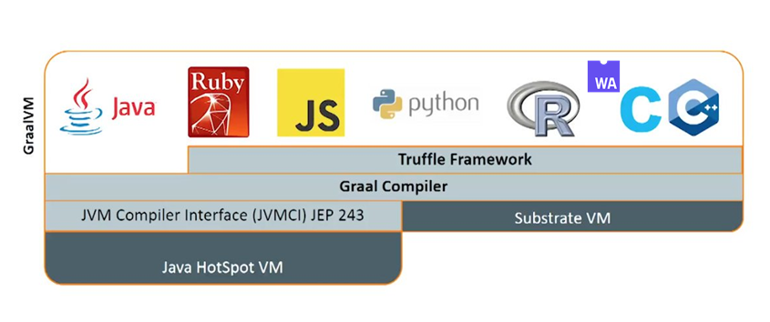

# JIT with GraalVM - the Polyglot Runtime Engine for Java, Node, Python, R and more

GraalVM is known for some very advanced features - such as Ahead of Time Compilation and Polyglot interoperability. Additionally, GraalVM is a runtime engine - for Java and other JVM based languages (replacing HotSpot JIT compiler) and for many other languages (that are compiled to run on GraalVM through the Truffle framework).

In this step, let's see how you interact with this runtime platform. Note: it will not feel as anything special. You will use the regular commands belonging to the specific language (platform) - and they will be executed by GraalVM - and you will hardly even know it. That of course is one of the objectives: transparent replacement of language runtime - with added value such as management and development tools, interoperability and better runtime characteristics, such as startup time, resource usage, throughput, runtime optimizations and performance - benefiting from large heap configurations and Java’s garbage collectors. 

Some of the GraalVM language implementations have shown substatial benefits in this runtime department. However, for some use cases, the results are not as good. You will have to verify for yourself how well GraalVM runs your application. 

With the next command, you first produce the Class file (compilation to byte code, not yet to executable machine code) and then run the Class, using the OpenJDK Java Runtime powered by the GraalVM JIT compiler. The execution time for this cold startup is measured - for comparison in the next step with the startup time for the native image created from this Java application.

```
cd /labs/java
javac PrimeNumbers.java

time java PrimeNumbers
```{{execute}}
Please take note of the value for *real* time (expected to be somewhere between 60 and 150 ms).

## Run JavaScript and Node applications - with GraalVM

GraalVM includes an ECMAScript compliant JavaScript engine. It is designed to be fully standard compliant, execute applications with high performance, and provide all the benefits from the GraalVM stack, including language interoperability and common tooling. With that engine, GraalVM can execute JavaScript and Node.js applications.

GraalVM can execute plain JavaScript code:

`js [options] [filename...] -- [args]`

GraalVM is adapted to run unmodified Node.js applications. Applications can import npm modules, including native ones.

To run Node.js-based applications, use the node utility in the GraalVM distribution:

'node [options] [filename] [args]'

To install a Node.js module, use the npm executable in the /bin folder of the GraalVM package. The npm command is equivalent to the default Node.js command and supports all Node.js APIs. Note that some npm modules will require to be re-compiled from source with GraalVM JavaScript if they ship with binaries that have been compiled for Node.js based on V8.

### Run PrimeNumbers.js Application
This command executes a Node application to generate a list of the first 100 prime numbers. The *node* executable invoked here is the GraalVM utility - not the regular Node distribution with V8 execution engine. GraalVM interprets the JavaScript code, turns it into a Java bytecode-like representation of the programming logic and executes it on the GraalVM JIT compiler.

```
cd /labs/nodejs
node PrimeNumbers.js
```{{execute}}

Feel free to browse the contents of the file `nodejs\PrimeNumbers.js`.

Open the Node application in the text editor or look at it in the terminal:
`cat /labs/nodejs/PrimeNumbers.js`{{execute}}
## Run Python applications - with GraalVM

GraalVM includes an early implementation of a Python 3.7 interpreter - and through this interpreter and Truffle also the ability to run Python applications. 

Python is experimental in the GraalVM ecosystem at the time of writing and not recommended for production use at this time, but the GraalVM team are actively working on stability and support for all modules. At this point in time, GraalVM can run simpler applications of Python but the runtime does not have the same full compatibility GraalVM provides for Java and Node.js applications. A primary goal is to support SciPy and its constituent libraries. At this point, the Python implementation is made available for experimentation and curious end-users.

While support for the Python language is still limited, you can run simple Python scripts or commands with the graalpython binary:

`graalpython [options] [-c cmd | filename]`

If no program file or command is given, you are dropped into a simple REPL.

GraalVM supports some of the same options as Python 3.7 and some additional options to control the underlying Python implementation, the GraalVM tools and the execution engine. These can be viewed using the following command:

`graalpython --help --help:tools --help:languages`

### Run PrimeNumbers Python Application

This command executes a Python application to generate a list of the first prime numbers between 1 and 100. 

```
cd /labs/python
graalpython PrimeNumbers.py 
```{{execute}}

Feel free to browse the contents of the file `python\PrimeNumbers.py`.

Open the Python application in the text editor or look at it in the terminal:
`cat /labs/python/PrimeNumbers.py`{{execute}}

## Other supported languages

GraalVM supports other languages too, such as R, Ruby, WebAssembly and (through the LLVM toolchain) C/C++, Rust and other languages that can be compiled to LLVM bitcode. We will not go into these other languages at this point.

