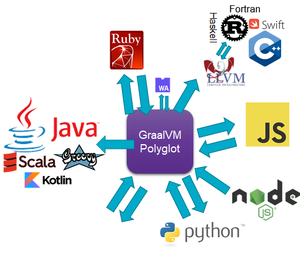
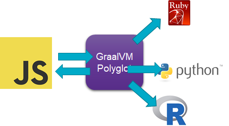

# Bonus: Multi-directional Polyglot

In this section, we will look at some examples of polyglot language interaction, not necessarily focused on Java, and involving more than just two languages.



## From Python to Java, JavaScript, Ruby and R

This article describes in detail a Python application running on GraalVM and interacting with both JavaScript, R, Ruby and Java. The code discussed in the article is also available in the VM.
To try out a Python application that interacts with all of JavaScript, Java and R, run this command :

```
cd /labs/polyglot

graalpython --polyglot --jvm ./python_polyglot.py
```{{execute}}

Inspect the contents of the Python application:

`cat /labs/polyglot/python_polyglot.py`{{execute}}

You see arrays initialized in four languages, value of *title* exported (from the Python context to the bindings object between all language runtime environments) and imported in a JavaScript function that is initialized and invoked from Python. Reversely, a JavaScript snippet is executed that exports an object called *key* to the bindings context with value *value*. In Python, this object is imported and printed.

A JavaScript function is created to square numbers and exported to the bindings object. This function is imported and used from the Python context. It is subsequently also imported from an R snippet that defines a function that is finally invoked from Python.

Your conclusion could be that many languages can be fused almost into one. This example shows how - but not yet when and why. 


## From JavaScript to Python, Ruby and R

Similar - but taking JavaScript as the starting language – is polyglot.js. This JavaScript application loads a Python library and invokes the Python function object that is created by that library. 

It also uses an R snippet that creates a function object and hands it back to the Polyglot context for all participating language contexts to invoke.

`cat /labs/polyglot/polyglot.js`{{execute}}

To try it out, run the application with this command – on the command line from directory /labs/polyglot:

`js --polyglot --jvm polyglot.js`{{execute}}

Please, take this opportunity and modify the source polyglot.js. Make it jump through even more hoops. Make the polyglot contexts share even more.

Open the file using good old *vi*:
`vi /labs/polyglot/polyglot.js`{{execute}}

Remember: use ESC + q! to leave the file without saving changes, or using ESC + wq to leave with saving your changes.